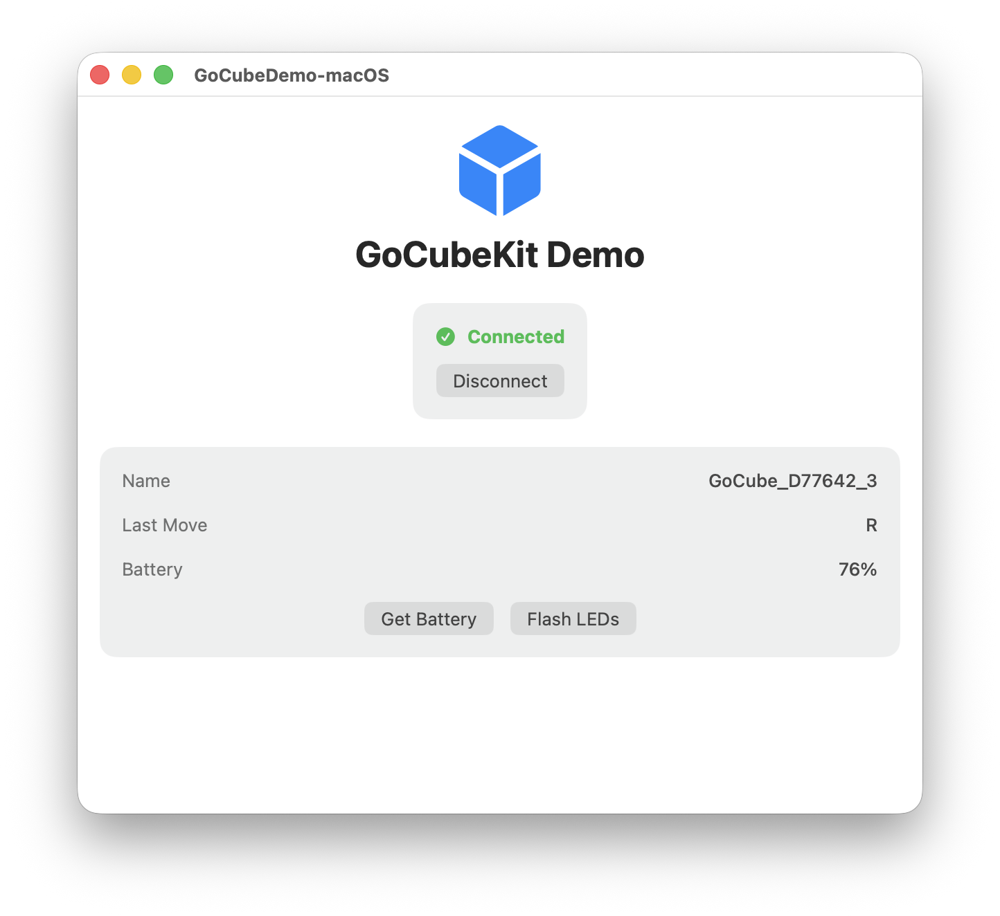

[](https://swiftpackageindex.com/Kosikowski/GoCubeKit)
[](https://swiftpackageindex.com/Kosikowski/GoCubeKit)
# GoCubeKit

A modern Swift library for communicating with GoCube smart Rubik's cubes over Bluetooth Low Energy.



## Features

- **Device Discovery & Connection** - BLE scanning and management with optional auto-reconnection
- **Real-time Move Tracking** - Capture rotations with face and direction information
- **Cube State Synchronization** - Get complete state of all 54 facelets
- **3D Orientation Tracking** - Quaternion updates at ~15 Hz for physical orientation
- **LED Control** - Flash LEDs and control animated backlighting
- **Battery Monitoring** - Request and track battery level
- **Move Notation** - Parse standard cube notation (R, U', F2, etc.)
- **Modern Swift Concurrency** - Built with async/await, actors, and AsyncStreams

## Requirements

- iOS 17.0+ / macOS 14.0+
- Swift 6.0+
- Xcode 16.0+

## Installation

### Swift Package Manager

Add GoCubeKit to your project through Xcode:

1. File > Add Package Dependencies
2. Enter the repository URL
3. Select the version you want to use

Or add it to your `Package.swift`:

```swift
dependencies: [
    .package(url: "https://github.com/Kosikowski/GoCubeKit.git", from: "1.0.0")
]
```

## Usage

### Basic Example

```swift
import GoCubeKit

let manager = GoCubeManager.shared

// Start listening and scanning
manager.startListening()
manager.startScanning()

// Connect to a discovered device
if let device = manager.discoveredDevices.first {
    let cube = try await manager.connect(to: device)

    // Listen to moves
    Task {
        for await move in cube.moves {
            print("Move: \(move.notation)")
        }
    }
}
```

### Connect to First Available Cube

```swift
let cube = try await manager.connectToFirstAvailable()
```

### Track Moves

```swift
for await move in cube.moves {
    print("Face: \(move.face), Direction: \(move.direction)")
    print("Notation: \(move.notation)")
}
```

### Get Cube State

```swift
if let state = try await cube.getState() {
    print("Solved: \(state.isSolved)")
    print("Solved percentage: \(state.solvedPercentage)%")
}
```

### Track Orientation

```swift
try cube.enableOrientation()

for await quaternion in cube.orientationUpdates {
    // Use quaternion for 3D visualization
}
```

### SwiftUI Integration

```swift
struct CubeView: View {
    @State private var manager = GoCubeManager.shared

    var body: some View {
        VStack {
            if let cube = manager.connectedCube {
                Text("Connected: \(cube.name)")
                Text("Battery: \(cube.batteryLevel ?? 0)%")
            } else {
                Button("Scan") { manager.startScanning() }
            }
        }
    }
}
```

### Configuration

```swift
var config = GoCubeConfiguration()
config.autoReconnect = true
config.maxReconnectAttempts = 5

let manager = GoCubeManager(configuration: config)
```

### Debug Logging

Enable debug logging to see BLE communication details:

```swift
import GoCubeKit

// Enable before connecting
GoCubeLogger.isEnabled = true
```

Logs appear in Xcode console or Console.app (filter by "com.gocubekit").

## Demo App

A demo app is included in the `Demo/` folder. To build it:

```bash
# Install XcodeGen if you don't have it
brew install xcodegen

# Generate the Xcode project
cd Demo
xcodegen generate

# Open the project
open GoCubeDemo.xcodeproj
```

## Protocol Reference

This library implements the GoCube BLE protocol. For protocol details, see: https://github.com/oddpetersson/gocube-protocol

## License

GoCubeKit is available under the MIT license. See the LICENSE file for more info.
